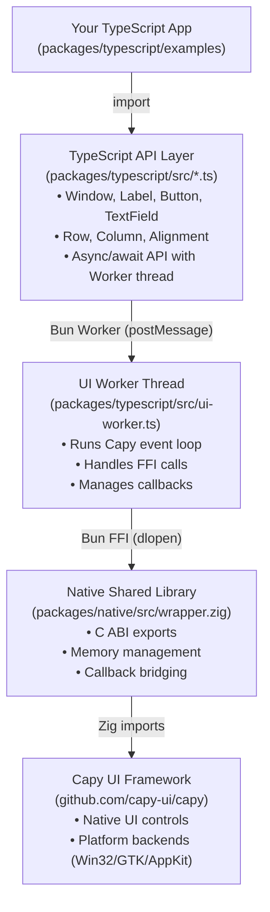

# Capy-Bun

Build native, cross-platform desktop applications with TypeScript and Bun. Capy-Bun provides TypeScript bindings for the [Capy UI framework](https://capy-ui.org/) using Bun's FFI.

## What is this?

A proof-of-concept that demonstrates:
- **Native UI in TypeScript**: Write desktop apps using native controls, not Electron
- **Bun FFI**: Leverage Bun's fast Foreign Function Interface to call Zig/C code
- **Worker-based Architecture**: Keep your main JavaScript thread responsive while UI runs on a separate thread
- **Single-file Executables**: Bundle everything (code + native library) into one distributable file

## Monorepo Structure

| Package | Description |
|---------|-------------|
| **[native](packages/native/)** | Zig wrapper that exposes Capy UI through a C ABI for FFI consumption |
| **[typescript](packages/typescript/)** | TypeScript library with Bun FFI bindings and async API |

## Quick Start

```bash
# 1. Build the native library
cd packages/native
zig build -Doptimize=ReleaseFast

# 2. Run an example
cd ../typescript
bun run examples/hello-world.ts
```

**That's it!** A native window will appear with "Hello, World!" centered.

## Documentation

For complete API documentation, guides, and examples, see:

**[typescript README](packages/typescript/README.md)** - Complete user documentation

Quick links:
- [API Reference](packages/typescript/README.md#api-reference)
- [Widget Documentation](packages/typescript/README.md#widgets)
- [Building Executables](packages/typescript/README.md#build-standalone-executable)
- [Architecture Details](packages/typescript/README.md#architecture)

## Architecture



## Example Code

```typescript
import { Window, Label, Button, Row } from "capy-ts";

// Create a window
const window = new Window();
await window.setTitle("My App");
await window.setPreferredSize(400, 200);

// Create widgets
const label = new Label({ text: "Click the button:", alignment: "Center" });
const button = new Button({
  label: "Say Hello",
  onclick: () => console.log("Hello from native UI!")
});

// Layout
const row = new Row([label, button]);
await window.setChild(row);
await window.show();
```

See [examples/](packages/typescript/examples/) for more complete examples.

## Features

- **Widgets**: Label, Button, TextField, Row, Column, Alignment
- **Callbacks**: Interactive buttons with TypeScript callbacks
- **Worker Thread**: Non-blocking UI event loop
- **Bundling**: Single-file executables with embedded native library
- **Type-safe**: Full TypeScript definitions

## Contributing

This is a proof-of-concept with room for expansion! See the [Contributing section](packages/typescript/README.md#contributing) for ideas.

## License

See the LICENSE file in the repository root.

## Acknowledgments

- **[Capy UI](https://github.com/capy-ui/capy)** - Zig UI framework
- **[Bun](https://bun.sh/)** - JavaScript runtime with FFI
- **[Zig](https://ziglang.org/)** - Systems programming language

